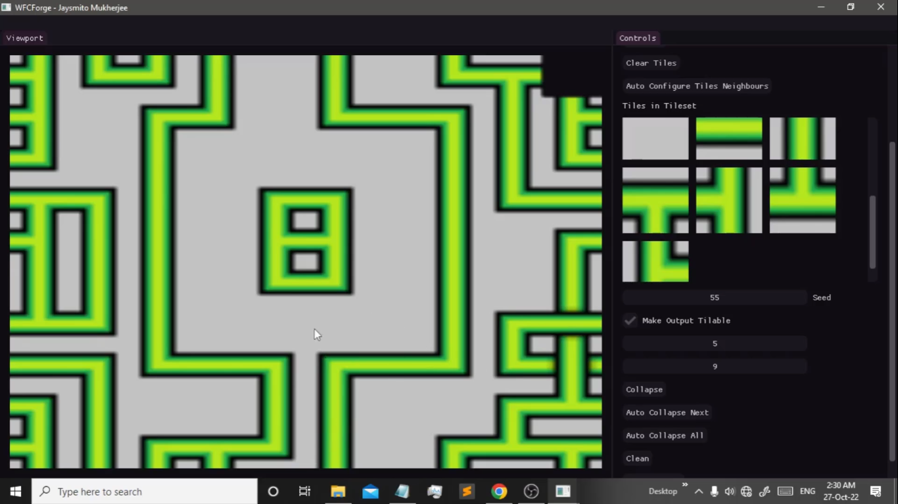
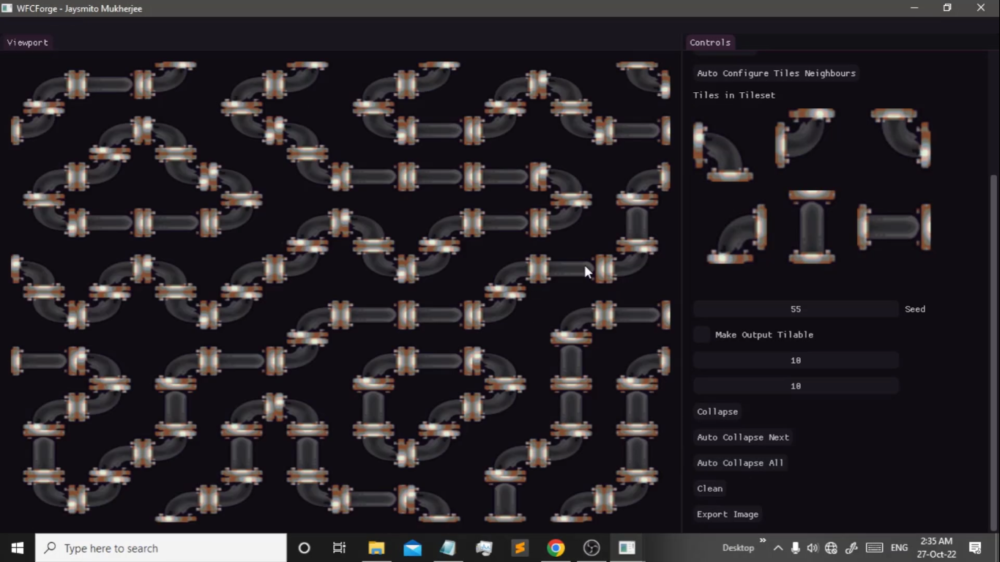
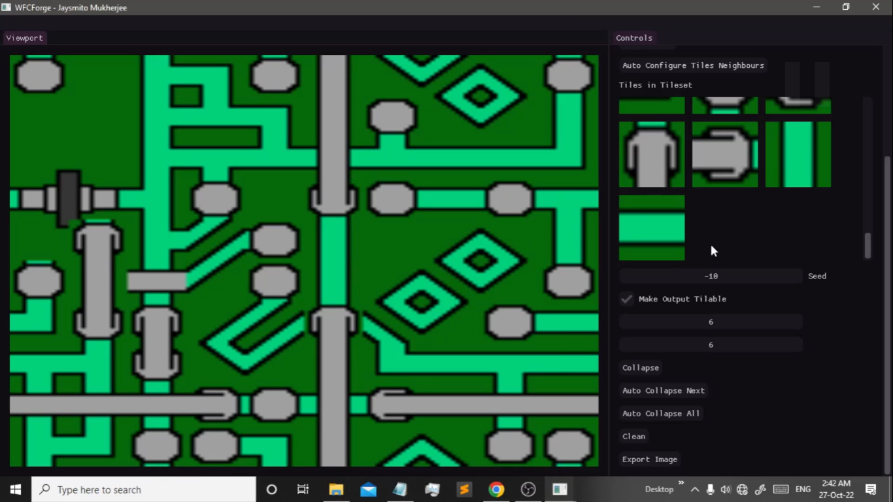
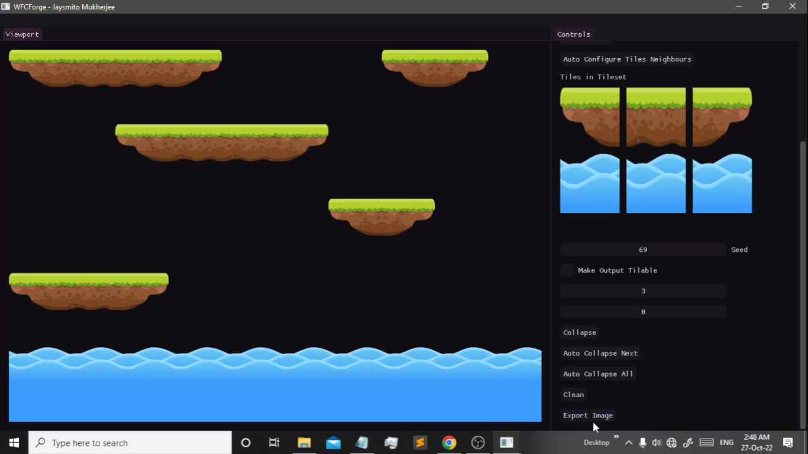
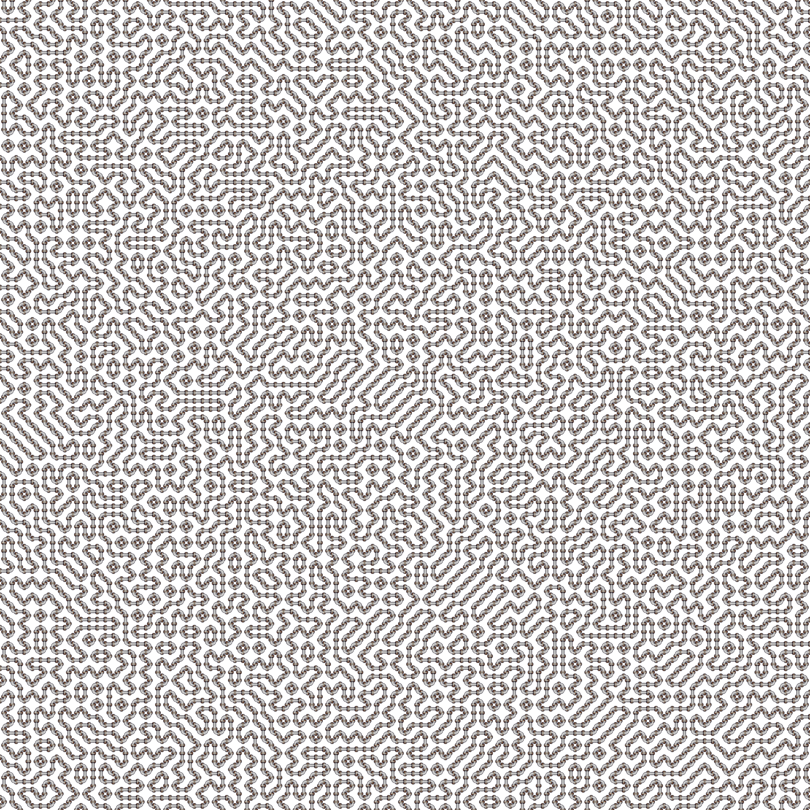
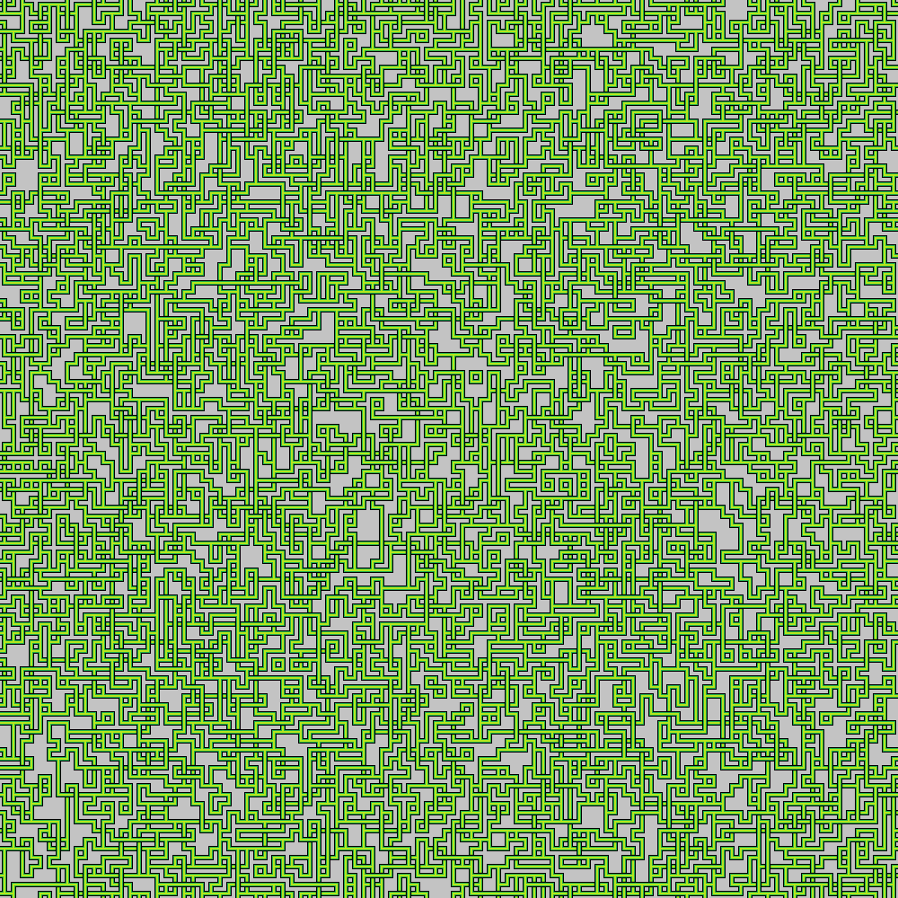

 

    </

 

  
  
  
     
    
    

 

# WFCForge

WFCForge is a procedural as well as a custom game art generator! This is based on [Wave Function Collapse](https://github.com/mxgmn/WaveFunctionCollapse).

## Tutorial : https://youtu.be/SFqquYiNGzg

## Screenshots

## Outputs

## Download: https://github.com/Jaysmito101/WFCForge/releases/download/v0.1/WFCForge.Win64.zip

