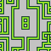

<br/>
<p align="center">
    </
</p>

<br/>
<p align="center">
  
  
  
    <br>
    
    <a href="https://patreon.com/jaysmito101"></a>
</p>
<br/>

# WFCForge

WFCForge is a procedural as well as a custom game art generator! This is based on [Wave Function Collapse](https://github.com/mxgmn/WaveFunctionCollapse).

## Tutorial : <https://youtu.be/SFqquYiNGzg>

## Screenshots


## Outputs




## Download: <https://github.com/Jaysmito101/WFCForge/releases/download/v0.1/WFCForge.Win64.zip>


## Building from source

### Linux

1. Install dependencies
   - Build chain: cmake, gcc (should be 13 to support C++20 format header)
   - Project deps: opengl (libgl1-mesa-dev)
   - GLFW deps: libxrandr-dev, libxinerama-dev, libxcursor-dev, libxi-dev
2. Run the [Helper.py](Helper.py) script as listed in the help output:
   1. Initialize & update the submodules:

      ```bash
      python Helper.py initsm && python Helper.py updatesm
      ```

   2. Generate the cmake files:

      ```bash
      python Helper.py generate
      ```

   3. Build the project:

      ```bash
      python Helper.py build
      ```
